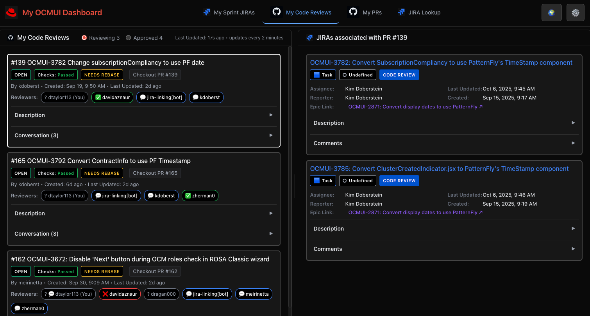
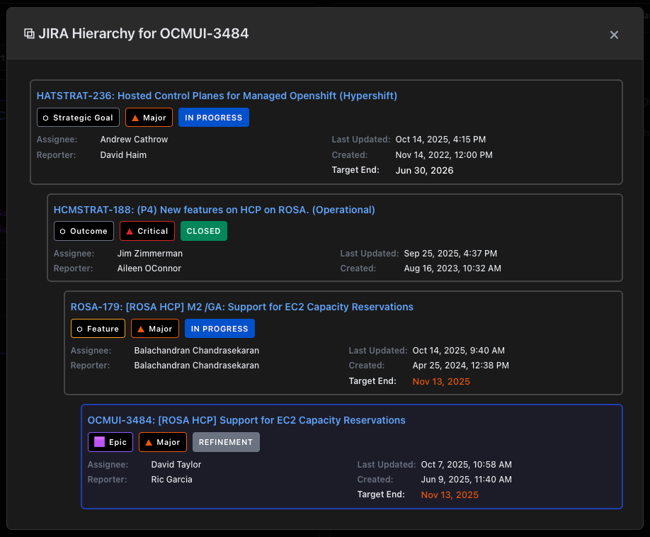
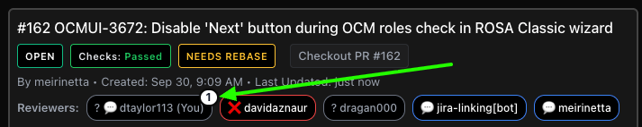

# 🎯 OCMUI Team Dashboard

> Modern React-based dashboard that unifies GitHub PR management with JIRA ticket tracking to streamline developer workflows for the Red Hat OCMUI team.


## ✨ Features

- **🔗 GitHub Integration**: Track PRs, code reviews, and repository activity  
- **📋 JIRA Integration**: Manage sprint tickets, view descriptions, comments with advanced markdown rendering
- **Jira Hierarchy View**: Click any JIRA card to see a popup containing a hierarchy tree of all of it's parents.

- **🌐 Unified Dashboard**: Single interface combining both platforms with auto-associations
- **⏰ Team Timeboard**: Multi-timezone team dashboard with business hours detection

- **🚀 Developer Productivity**: Reduce context switching between GitHub and JIRA
- **🛎 Activity Badges**: 
  - PR reviewer badges show a top-right notification circle for new or edited comments since last view!
  
  - JIRA Comments section shows a superscript notification badge for new or edited comments since last view
  - Age-based urgency for PR badges (white/yellow/red outline)
  - “Needs Rebase” badge on PRs when branch is behind or has conflicts
  - “Ready to Merge” badge when 3+ approvals, checks pass, and branch is up-to-date (hides Checks badge)
  - One-click “Checkout PR #<n>” button copies `gh pr checkout <n>`

## 📱 Interface

### Navigation Tabs
1. **My Sprint JIRAs** - Current sprint tickets with status tracking
2. **My Code Reviews** - PRs awaiting user review 
3. **My PRs** - Personal PRs with open/closed filtering  
4. **JIRA Lookup** - Search any JIRA ticket with history

### Key Features
- **Auto-Association**: Click any JIRA to see related PRs, or any PR to see related JIRAs
- **Rich Markdown**: Full GitHub and JIRA markdown rendering with image support
- **Smart Caching**: Background updates with React Query
- **Timezone Awareness**: All timestamps in your selected timezone (DST-aware via IANA timezones)
- **Team Dashboard**: Inline add/edit/delete of members; identity selection (“I am …”); reference time mode; timezone dropdown labeled with current UTC offset and sortable by offset
  - Reference Time input with 30‑minute steps (09:00–17:00) and TZ dropdown sortable alphabetically or by GMT offset
- **Comment Awareness**: JIRA comments sorted by latest activity (updated if present); edited comments labeled “(edited)”
- **Accurate PR Checks**: Checks badge reflects GitHub combined status and shows failing/pending context names in a tooltip

## 🚀 Quick Start

### 🌐 Use the Hosted Version (Recommended)

The dashboard is deployed and ready to use:

**https://ocmui-team-dashboard-ocmui-dashboard.apps.rosa.c9a9m7g8h3p4x6t.rz7k.p3.openshiftapps.com**

- No tokens required! Server provides GitHub and JIRA access
- Just select yourself from the team roster and confirm your usernames

---

### 💻 Local Development

#### Prerequisites
- Node.js 18+
- Yarn package manager
- Service account tokens (for full functionality)

#### Installation & Setup

1. **Clone the repository**
   ```bash
   git clone git@github.com:dtaylor113/ocmui-team-dashboard.git
   cd ocmui-team-dashboard
   ```

2. **Install dependencies**
   ```bash
   yarn install
   ```

3. **Start the application**
   ```bash
   # With service account tokens (full functionality)
   GITHUB_TOKEN=ghp_xxxx JIRA_TOKEN=xxxx yarn start

   # Or without tokens (GitHub/JIRA features will be disabled)
   yarn start
   ```
   - Builds and serves the application at `http://localhost:3017`
   - **Single server setup** - Production-ready architecture

4. **Configure your identity**

   - Open `http://localhost:3017`
   - Click Settings ⚙️ in the top-right corner
   - Verify GitHub and JIRA connections show ✅ (if tokens are set)
   - Enter your **GitHub username** and **JIRA email**
   - Click **Save**

> **Note**: Users no longer need their own API tokens! The server provides them via environment variables.

## 🔧 Development (optional)

```bash
# With hot reloading
GITHUB_TOKEN=ghp_xxxx JIRA_TOKEN=xxxx yarn start:dev
```
- **API Server**: `http://localhost:3017` (Express.js)
- **React App**: `http://localhost:5174` (Vite HMR)

### Environment Variables

| Variable | Description |
|----------|-------------|
| `GITHUB_TOKEN` | GitHub personal access token (service account) |
| `JIRA_TOKEN` | Red Hat JIRA personal access token |
| `PORT` | Server port (default: 3017) |

## 🚢 Deploying to OpenShift

A convenient deploy script is included:

```bash
# Full build and deploy
./deploy.sh

# Skip build (just push and deploy existing image)
./deploy.sh --skip-build
```

See `README-openshift.md` for detailed deployment documentation.

## 📖 Documentation

- See `APP_TECH_NOTES.md` for detailed architecture, backend, and API integration.

## 🌍 Team Timeboard

- **Multi-timezone Support**: View all team members' local times
- **Business Hours Detection**: Visual indicators for off-hours
- **Identity Selection**: "I am..." feature for easy timezone setup
- **Reference Time Mode**: Choose a time (09:00–17:00, 30‑min steps) and TZ to compare teammates' local times; TZ dropdown can be sorted alphabetically or by GMT offset; all renders use IANA rules for correct DST handling
- **Shared Roster**: Team roster is stored server-side (PVC) and shared across all users

## 👤 Admin: Managing the Team Roster

The team roster is shared across all users and stored on the server. Regular users can view the roster and identify themselves, but adding/editing/deleting members requires admin access.

### Option 1: Edit directly on the server (OpenShift)

```bash
# SSH into the running pod
oc rsh deployment/ocmui-team-dashboard

# Edit the data file
vi /data/members.json

# Changes take effect immediately (users can click Refresh in Timeboard)
```

### Option 2: Update via the seed file (Git)

1. Edit `public/timeboard/members.json` in the repository
2. Commit and push the changes
3. Rebuild and redeploy the container
4. The new roster will be loaded on first startup (if `/data/members.json` doesn't exist) or you can reset via API:
   ```bash
   curl -X POST https://YOUR_ROUTE/api/team/members/reload
   ```

### Roster Entry Format

```json
{
  "name": "Jane Doe",
  "role": "dev",
  "tz": "America/New_York",
  "github": "janedoe",
  "jira": "jdoe@redhat.com"
}
```

| Field | Required | Description |
|-------|----------|-------------|
| `name` | Yes | Display name |
| `role` | Yes | Role (dev, qe, manager, etc.) |
| `tz` | Yes | IANA timezone (e.g., `America/New_York`) |
| `github` | No | GitHub username for PR filtering |
| `jira` | No | JIRA email for ticket filtering |

## 🐛 Troubleshooting

### Common Issues

**Port 3017 already in use:**
```bash
lsof -ti:3017 | xargs kill -9
yarn start
```

**"GitHub service not available" / "JIRA not configured" errors (local):**
- You need to set the environment variables when starting the server:
  ```bash
  GITHUB_TOKEN=ghp_xxxx JIRA_TOKEN=xxxx yarn start
  ```
- Or use the hosted version which has tokens pre-configured

**GitHub images not loading:**
- Images automatically fallback to clickable links when blocked
- Use `yarn start` (single server) for optimal image loading

**"0 Sprint JIRAs" but you have tickets:**
- Verify your JIRA email is correct in Settings
- Check that the server has a valid JIRA token (Settings → Check Status)

**Want to test the first-run flow again?**
- Click Settings → 🚪 Log Out
- This clears all local data and restarts the "Who are you?" flow

## 📖 Documentation

- **[APP_TECH_NOTES.md](APP_TECH_NOTES.md)** - Complete technical documentation
- **Component Architecture** - Detailed React component structure
- **API Integration** - GitHub and JIRA API usage patterns
- **Deployment Guide** - Production setup instructions

## 📄 License

MIT License - see LICENSE file for details

---

**Built for the Red Hat OCMUI Team** 🚀